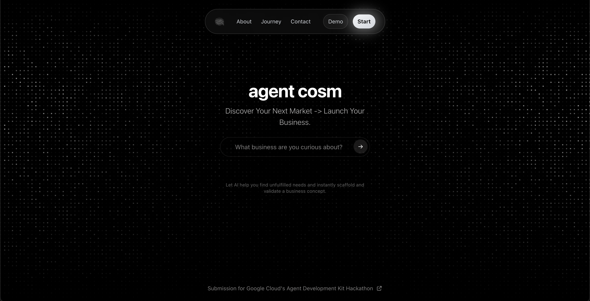
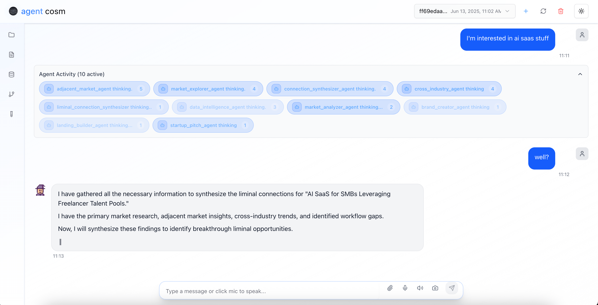
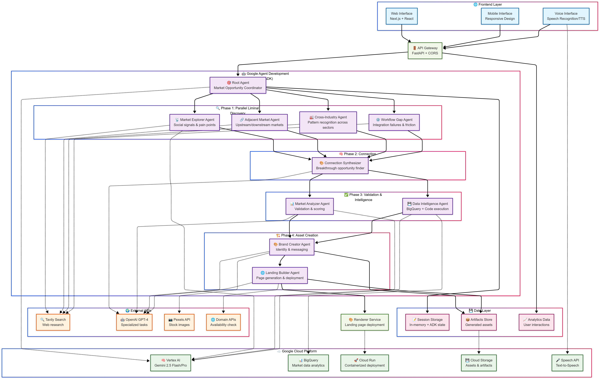

# agentcosm
## Add file upload in messageinput
## See if i can make the litellm wrapper with retry & exponential backoff

Navigating Liminal Market Spaces to Launch Your Mini-Business



## Agent Diagram
[![](https://mermaid.ink/img/pako:eNqdWc2O2zYQfhVDQYAWYBZre3-9QC8Jekp7aG6FAYEr0TZriRRIane1i7xF0WsvBfp6fYQOJVGrH5KiHSCBrfnmI2fImfkUv0UJT0m0ifYCF4fF19-2bLH4-HHxTVUZkYsdFwsGAKkfJxmW8gvZLRLORUoZVmDd0SzbfLj8-Xq1WiOpBD-S7mvCMy42H5L6DxK8ZClJHwZUeE-YWpAso4UkqCFbr9fX69uOrHUfkA1JHvnLItjV7APJAy7IRpBEAVsb9q8m1ozmEGAW51gciYp5UXChSkZVFfei_2Eb_ff3P38ForfRj33qlMqEPxFRxc9cHHcZfx7TTRFOiuKAJXH71-bWud0keSkgK0TE9REYV6uxdTR0EFNeCHIgTNInYoKWdA9ryproz3_DwC3xE85oihUxj-NEcCnjIsMKLmBuKGdgLZkkWCSHYVT9Zy0Mp3_gBL6aHQ3wVuM4CyMQbAQLnGUkm6TAiWwpd5SlcVnArSU4j1P-zNqP-si7jPpRLVWTEkCWYKyGUdlsk6MdYgqsFBHME9ucQz_EDpVwqfTtBBBVlAxDdKJaKprCvumuinUZi1LRjL6Snhs0BcixoQxDm-xxxqAfUM5iWTF1IBLAowrxYcwV7J7HphTfvbqd-VHj0ugvC8fO9uowqQsLpqURmB27Vd7bUy_1bsSo59jjH7ceO2oYlDZSpnTzh-QlZNjEvKBhK8OwYvXqaGVDY3fQlqbUW_GZqkMMN1xQto_VAcoMevje5Oo87_5RDBLc4HWQMIQVXM56y5LK6cpnOZsaxwoPUzlIl8Nsiu59gRrYrYKhYiUMNwB3JReANV1YVx_0ENIkbnABbLbW7VFoqtrER6duMXWtkegiaQBNW1BVd6Q2o7n58Eyf5GNJs3R8y6xGs039LDaIopeiqcW0DoXhaIu4oGoyxKam1gk-Ep3v1pSS5GgWspg6J2iuBMZ8levRBOyqlO9uFuMwjw2hLHO4_1UsiL6To2zaIOMtU_ZE9J2ISY5pFiuS63lOJvt34MZ0kidUCzGSUhwXMEDkhGkKmaRREAlhN_eOcUWmJFPIMDtpCX9p17Nwcuydvg_ja1B6TS1kvH3IgEyFNe2vlmEELrVG6nsnE1C_hsgLMjs6wN0B2QHpZzF-gkPAj7D5Xgm5ADVBK7C_UnY8QWAvPn36ySeHvXLa4dw0EreKrt3sOtilnmuXMMXrpZhTuF7ngchlcwHaJa5LGA8DdOtZr_-MgPX6nhacVek61PHo7ObkrI9lRr76XANlqo_ixBT5ZOyMFG6W88vXEAqvcA0h8IjWoBACMmZtJg51O6uSAxMXQDKXugAKf_JCAjk1fX5JP_di0O_LI1HvehVob_pZat3LeZ4OD4rQpcPdCr5pICGie4bj5AO1SnSHrK8dbOrcrufbPm5T5b4F7HLcJeKbPU21uG8Fmwy3C_cabhPgXrhNeHscfFI7ZFsuXR3ia1HSQZmYauf5AO1imZ0oJf2K-TQuv2g-cV9O7XwaT_hsCSALnTEBVL5Z074ZfNb_m9_7oSGUvvf5Yeo8bVzIoYqQVVkjqyRFNhGGfHoD-ecp8s4FZB1EyNHKka11IUuLRdaeiGyFWP_bS2_Quw6aeZ1B_XmD5t8ukP8FAgWLeOQX6ihMjCN_sSFf-SB3QaDz9Ao6S5KgENmArGMYTecmsgw7ZJ1oyDO20NxsQp4BhDxTBvlGCfKOBuRt9sjZvvVPkw8RinIiwJZGm-hNF9E2gouTk220gY8p2eEyU9toy74DFJeKf6tYEm2UKAmKBC_3h2izg_qBb2Whr9QXiuHQcgMpMPud8_7XaPMWvUSb5f3txfJqfb-8v7lcrpbLqxWKqmhzvb64u7m7vL-6XF1dra7vV99R9FoTXF7c3V6jaC_0Xtv1iS6Cz7xkCghvUATJhjP5pfnZuP71-Pv_7MbSdA?type=png)](https://mermaid.live/edit#pako:eNqdWc2O2zYQfhVDQYAWYBZre3-9QC8Jekp7aG6FAYEr0TZriRRIane1i7xF0WsvBfp6fYQOJVGrH5KiHSCBrfnmI2fImfkUv0UJT0m0ifYCF4fF19-2bLH4-HHxTVUZkYsdFwsGAKkfJxmW8gvZLRLORUoZVmDd0SzbfLj8-Xq1WiOpBD-S7mvCMy42H5L6DxK8ZClJHwZUeE-YWpAso4UkqCFbr9fX69uOrHUfkA1JHvnLItjV7APJAy7IRpBEAVsb9q8m1ozmEGAW51gciYp5UXChSkZVFfei_2Eb_ff3P38ForfRj33qlMqEPxFRxc9cHHcZfx7TTRFOiuKAJXH71-bWud0keSkgK0TE9REYV6uxdTR0EFNeCHIgTNInYoKWdA9ryproz3_DwC3xE85oihUxj-NEcCnjIsMKLmBuKGdgLZkkWCSHYVT9Zy0Mp3_gBL6aHQ3wVuM4CyMQbAQLnGUkm6TAiWwpd5SlcVnArSU4j1P-zNqP-si7jPpRLVWTEkCWYKyGUdlsk6MdYgqsFBHME9ucQz_EDpVwqfTtBBBVlAxDdKJaKprCvumuinUZi1LRjL6Snhs0BcixoQxDm-xxxqAfUM5iWTF1IBLAowrxYcwV7J7HphTfvbqd-VHj0ugvC8fO9uowqQsLpqURmB27Vd7bUy_1bsSo59jjH7ceO2oYlDZSpnTzh-QlZNjEvKBhK8OwYvXqaGVDY3fQlqbUW_GZqkMMN1xQto_VAcoMevje5Oo87_5RDBLc4HWQMIQVXM56y5LK6cpnOZsaxwoPUzlIl8Nsiu59gRrYrYKhYiUMNwB3JReANV1YVx_0ENIkbnABbLbW7VFoqtrER6duMXWtkegiaQBNW1BVd6Q2o7n58Eyf5GNJs3R8y6xGs039LDaIopeiqcW0DoXhaIu4oGoyxKam1gk-Ep3v1pSS5GgWspg6J2iuBMZ8levRBOyqlO9uFuMwjw2hLHO4_1UsiL6To2zaIOMtU_ZE9J2ISY5pFiuS63lOJvt34MZ0kidUCzGSUhwXMEDkhGkKmaRREAlhN_eOcUWmJFPIMDtpCX9p17Nwcuydvg_ja1B6TS1kvH3IgEyFNe2vlmEELrVG6nsnE1C_hsgLMjs6wN0B2QHpZzF-gkPAj7D5Xgm5ADVBK7C_UnY8QWAvPn36ySeHvXLa4dw0EreKrt3sOtilnmuXMMXrpZhTuF7ngchlcwHaJa5LGA8DdOtZr_-MgPX6nhacVek61PHo7ObkrI9lRr76XANlqo_ixBT5ZOyMFG6W88vXEAqvcA0h8IjWoBACMmZtJg51O6uSAxMXQDKXugAKf_JCAjk1fX5JP_di0O_LI1HvehVob_pZat3LeZ4OD4rQpcPdCr5pICGie4bj5AO1SnSHrK8dbOrcrufbPm5T5b4F7HLcJeKbPU21uG8Fmwy3C_cabhPgXrhNeHscfFI7ZFsuXR3ia1HSQZmYauf5AO1imZ0oJf2K-TQuv2g-cV9O7XwaT_hsCSALnTEBVL5Z074ZfNb_m9_7oSGUvvf5Yeo8bVzIoYqQVVkjqyRFNhGGfHoD-ecp8s4FZB1EyNHKka11IUuLRdaeiGyFWP_bS2_Quw6aeZ1B_XmD5t8ukP8FAgWLeOQX6ihMjCN_sSFf-SB3QaDz9Ao6S5KgENmArGMYTecmsgw7ZJ1oyDO20NxsQp4BhDxTBvlGCfKOBuRt9sjZvvVPkw8RinIiwJZGm-hNF9E2gouTk220gY8p2eEyU9toy74DFJeKf6tYEm2UKAmKBC_3h2izg_qBb2Whr9QXiuHQcgMpMPud8_7XaPMWvUSb5f3txfJqfb-8v7lcrpbLqxWKqmhzvb64u7m7vL-6XF1dra7vV99R9FoTXF7c3V6jaC_0Xtv1iS6Cz7xkCghvUATJhjP5pfnZuP71-Pv_7MbSdA)

## App Architecture

## Overview

**agentcosm** is an AI-powered platform designed to help entrepreneurs navigate the ambiguous "liminal spaces" between established market categories—those fertile, underexplored gaps where untapped demand lies.
With software development commoditized by AI, the real challenge today is *discovering* what to build, not just building it. agentcosm automates this discovery by analyzing social media, forums, reviews, and search trends to surface hidden opportunities.

---

## The Entrepreneurial Threshold Dilemma

Entrepreneurs often find themselves stuck between identifying promising market gaps and actualizing those ideas. The process of transforming vague market signals into testable businesses is long and uncertain: defining value propositions, building brands, and coding landing pages before even validating demand.

agentcosm bridges this divide by orchestrating specialized AI agents to scout, map, and build mini-businesses quickly, eliminating guesswork and reducing time to market.

---

## What agentcosm Does: The Liminal Space Navigator

agentcosm is a collaborative team of AI agents that:

* **Discover** hidden opportunities by analyzing social media, forums, reviews, and search trends to identify patterns of frustration and unmet needs in the spaces between established markets.
* **Bridge** the gap to validation by instantly scaffolding mini-businesses with tailored target audience profiles, value propositions, branding, and working landing pages ready for testing.
* **Communicate** across thresholds, passing insights and iterating collaboratively to transform raw market signals into actionable business concepts.

---

## Architecture & Agents

Built using Google's Agent Development Kit (ADK), agentcosm leverages specialized agents working in concert:

* **Explorer Agents:** Dive into undefined territories of social media, forums, and review sites to gather raw signals of market frustrations.
* **Cartographer Agents:** Analyze and map relationships between disparate data points, pinpointing viable market gaps.
* **Builder Agents:** Convert abstract opportunities into concrete business assets—branding, value propositions, and functional landing pages—for rapid validation.

This multi-agent workflow enables seamless collaboration and continuous refinement across the entire entrepreneurial threshold.

---

## Future Direction: Navigating the Next Frontier

Currently focused on market discovery and initial validation, agentcosm is evolving to navigate more complex liminal spaces—specifically the transition from validation to scaling. Upcoming enhancements include:

* Sophisticated opportunity assessment and prioritization
* Automated generation of business assets for scaling
* A frictionless pathway from idea to full-scale business leveraging serverless infrastructure

---

## Serverless Entrepreneurship Platform Convergence

agentcosm integrates Google Cloud's serverless architecture, Firebase rapid prototyping, and Vertex AI’s ML capabilities to form a full-stack entrepreneurship platform. This serverless ecosystem reduces technical barriers, enabling entrepreneurs to:

* Discover new market opportunities
* Validate business ideas instantly
* Deploy and scale businesses with minimal overhead

---

## Usage

agentcosm’s agents perform:

* Market research and trend analysis
* Business intelligence code generation
* Drafting detailed reports
* Automated landing page creation

To get started, clone this repo and follow the setup instructions below. The platform is designed to be modular and extensible with additional agents and workflows.

---

## Getting Started

```bash
git clone https://github.com/MR-GREEN1337/agentcosm.git
cd agentcosm
# Follow platform-specific setup instructions here (to be added)
```

---

## Contribution

Contributions are welcome! Please open issues or pull requests to suggest improvements, add agents, or refine workflows.

---

## License

This project is licensed under the MIT License.

---

## Contact

For questions or collaboration inquiries, contact:
**Islam HACHIMI**
Email: [islam.hachimi2003@gmail.com](mailto:islam.hachimi2003@gmail.com)
